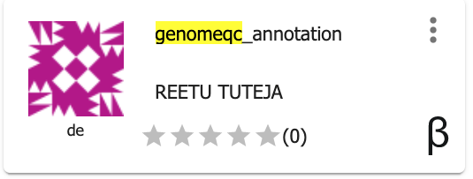

.. include:: cyverse_rst_defined_substitutions.txt

|CyVerse logo|_

|Home_Icon|_
`Learning Center Home <http://learning.cyverse.org/>`_

**GenomeQC App in the Discovery Environment**
----------------------------------------------------

GenomeQC pipeline integrates various quantitative measures to characterize genome assemblies and annotations. We have used the containerized version of GenomeQC to create an app in Discovery Environment.

---------------------------------------------------

**Launch GenomeQC app**

.. Note:: 

.. Comment: Right-Click the below button and open in a new tab for quick launch of SequenceServer analysis with test database

            |sequenceserver|_

1. Login to the |discovery_enviornment|.

2. CLick on "Apps" tab in the Discovery Enviornment and search for "GenomeQC".

3. Click on the app icon.

|genomeqc_app_icon|_

4. Change the name of the analysis and output folder as needed or leave for defaults.

5. Under "Inputs" provide the genome annotation, transcript and BUSCO dataset. Use the example dataset or provide your own dataset.

6. Under "Resource Requirements" request resources as needed or leave for defaults 

7. Click **Launch Analysis**. You will receive a notification that the job has been submitted and running. Click on 'Access your analysis here' link.

..
	#### Comment: short text description goes here ####

**Prerequisites**

**Downloads, access, and services**

*In order to complete this tutorial you will need access to the following services/software*

..
  #### comment: delete any row not needed in this table ####

.. list-table::
    :header-rows: 1

    * - Prerequisite
      - Preparation/Notes
      - Link/Download
    * - CyVerse account
      - You will need a CyVerse account to complete this exercise
      - |CyVerse User Portal|
    * - JetStream access
      - You must have access to JetStream
      - |JetStream|
    * - Cyberduck
      - Standalone software for upload/download to Data Store
      - |Download Cyberduck|

**Platform(s)**

*We will use the following CyVerse platform(s):*

 ..
   #### comment: delete any row not needed in this table ####

.. list-table::
    :header-rows: 1

    * - Platform
      - Interface
      - Link
      - Platform Documentation
      - Quick Start
    * - Data Store
      - GUI/Command line
      - |Data Store|
      - |Data Store Manual|
      - |Data Store Guide|
    * - Discovery Environment
      - Web/Point-and-click
      - |Discovery Environment|
      - |DE Manual|
      - |Discovery Environment Guide|

**Application(s) used**
..
  #### Comment: these tables are examples, delete whatever is unnecessary ####

**Discovery Environment App(s):**

.. list-table::
    :header-rows: 1

    * - App name
      - Version
      - Description
      - App link
      - Notes/other links
    * - GenomeQC_annotation
      - 1.0
      - Genome Annotation Quality
      - |DE Application URL|
      - |Original App Documentation|

**Input and example data**

*In order to complete this tutorial you will need to have the following inputs prepared*

.. list-table::
    :header-rows: 1

    * - Input File(s)
      - Format
      - Preparation/Notes
      - Example Data
    * - Genome annotation, transcript file, BUSCO dataset
      - GFF, FASTA
      - BUSCO sample datasets Community Data -> iplantcollaborative -> example_data -> BUSCO.sample.data
      - Community Data -> iplantcollaborative -> example_data -> genomeqc_annotation

----

**Fix or improve this documentation**

Search for an answer:
|CyVerse Learning Center| or
|CyVerse Wiki|

----

|Home_Icon|_
`Learning Center Home <http://learning.cyverse.org/>`__

.. Comment: Place Images Below This Line
   use :width: to give a desired width for your image
   use :height: to give a desired height for your image
   replace the image name/location and URL if hyperlinked

 .. |Clickable hyperlinked image| image:: ./img/IMAGENAME.png
    :width: 500
    :height: 100
 .. _CyVerse logo: http://learning.cyverse.org/

 .. |Static image| image:: ./img/IMAGENAME.png
    :width: 25
    :height: 25

.. Comment: Place URLS Below This Line

   # Use this example to ensure that links open in new tabs, avoiding
   # forcing users to leave the document, and making it easy to update links
   # In a single place in this document

   .. |Substitution| raw:: html # Place this anywhere in the text you want a hyperlink

      <a href="REPLACE_THIS_WITH_URL" target="blank">Replace_with_text</a>

.. |Github Repo Link|  raw:: html

   <a href="FIX_FIX_FIX_FIX_FIX_FIX_FIX_FIX_FIX_FIX_FIX_FIX_FIX_FIX_FIX" target="blank">Github Repo Link</a>

.. |Download Cyberduck| raw:: html

   <a href="https://cyberduck.io/" target="blank">Download Cyberduck</a>

.. |DE Application URL|  raw:: html

   <a href="https://de.cyverse.org/de/?type=apps&app-id=9b36fa5c-ff5a-11e9-a279-008cfa5ae621&system-id=de" target="blank">DE Application URL</a>

.. |Original App Documentation|  raw:: html

   <a href="https://wiki.cyverse.org/wiki/display/TUT/Evaluate+Genome+Annotation+Quality" target="blank">Original App Documentation</a>

.. |Atmosphere Image|  raw:: html

   <a href="https://atmo.cyverse.org/application/images/1384" target="blank">Atmosphere Image</a>

.. |JetStream|  raw:: html

   <a href="https://jetstream-cloud.org/" target="blank">Atmosphere Image</a>

.. _genomeqc_app_icon: http://learning.cyverse.org/

.. |discovery_enviornment| raw:: html

    <a href="https://de.cyverse.org/de/" target="_blank">Discovery Environment</a>

